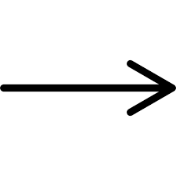
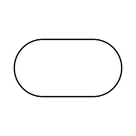
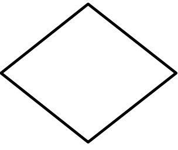
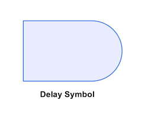
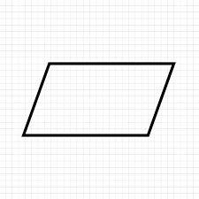
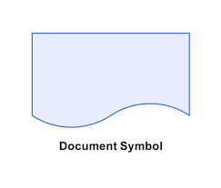

# Algoritimo

Algoritmo é como uma sequência de passos para resolver um problema.

**Foi feito um fluxograma desenvolvido em Aula:**

Inicio -> Digite o nome do seu abrigo -> Tem boclos suficiente -> sim -> Parar de colher blocos, nao -> Colher mais blocos -> Construir o abrigo -> Ainda tem blocos o suficiente -> Finalizar a construção -> Mensagem de saida: Abrigo finalizado.

## Significados dos símbolos de mapeamento de processo de fluxograma

### Seta

O primeiro símbolo a ser exibido é a seta, um símbolo de conexão usado para indicar um link entre dois outros símbolos e a direção do fluxo.
As setas em fluxogramas desempenham um papel crucial—elas mostram a direção do fluxo, guiando o leitor através do processo de um passo para o próximo. Pense nelas como o “tecido conectivo” entre diferentes símbolos ou ações. Sem setas, um fluxograma seria apenas uma coleção de caixas sem uma sequência clara.

### Terminação

Terminação refere-se ao início ou fim de um processo. É representado por um símbolo especial: um oval (ou às vezes um retângulo arredondado), frequentemente rotulado com palavras como "Início", "Fim" ou "Saída".

### Processo

Um processo representa uma tarefa, ação ou operação específica que precisa ser realizada. É um dos elementos mais comuns em fluxogramas e é tipicamente mostrado como um retângulo.
Em resumo, os simbólos de processo são o "cavalo de batalha" de um fluxograma. Eles mapeiam o que realmente é feito em cada etapa, ajudando a tornar fluxos de trabalho complexos fáceis de entender e analisar.

### Decisão

Uma decisão representa um ponto onde uma escolha deve ser feita—tipicamente uma pergunta de sim/não ou verdadeiro/falso. É simbolizada por uma forma de diamante.
Em essência, os pontos de decisão são o que tornam os fluxogramas dinâmicos. Eles adicionam lógica e permitem caminhos alternativos, facilitando a modelagem de processos do mundo real que dependem de condições ou regras.

### Atraso

O símbolo de Atraso representa uma pausa ou período de espera em um processo. É usado quando o fluxo de trabalho deve parar temporariamente—seja para esperar que uma condição seja atendida, um temporizador expire ou uma ação externa seja concluída. O símbolo se parece com um semicírculo em forma de “D”, com o lado plano à esquerda.

**Exemplos de símbolo de Atraso:**

- “Esperar por entrada do usuário”
- “Pausar 10 segundos”
- “Aguardar até receber aprovação”

É comumente usado em sistemas automatizados, fluxos de trabalho de usuários ou qualquer processo que não seja instantâneo.

### Dados

O símbolo de Dados é usado para representar informações sendo armazenadas ou recuperadas, tipicamente de um arquivo, banco de dados ou outro meio de armazenamento. Geralmente é desenhado como um retângulo inclinado (um paralelogramo) ou um cilindro se referindo especificamente a um banco de dados.

**Existem algumas variações:**

1. **Dados de Entrada/Saída** (paralelogramo) – Muitas vezes se sobrepõe ao símbolo de E/S e mostra dados entrando ou saindo.
2. **Dados Armazenados** (retângulo aberto, também conhecido como "armazenamento de dados") – Representa dados em repouso, como um arquivo ou documento.
3. **Banco de Dados**  (cilindro) – Usado especificamente para mostrar armazenamento em um banco de dados estruturado.

O símbolo de Dados traz contexto sobre quais informações estão sendo manipuladas no processo. Ajuda os visualizadores a entender onde os dados vivem, como são usados e quando são movidos, o que é especialmente útil em software, fluxos de trabalho de negócios ou pipelines de dados.

### Documento

O símbolo de Documento representa um documento único gerado, recebido ou usado em um processo. Parece um retângulo com uma borda inferior ondulada (curvada), lembrando uma folha de papel.

Este símbolo de fluxograma é especialmente útil em processos de negócio, fluxos de trabalho legais ou sistemas onde a papelada (digital ou física) desempenha um papel. Ajuda a esclarecer quais documentos estão envolvidos em quais etapas, tornando seu fluxograma mais completo e informativo.

